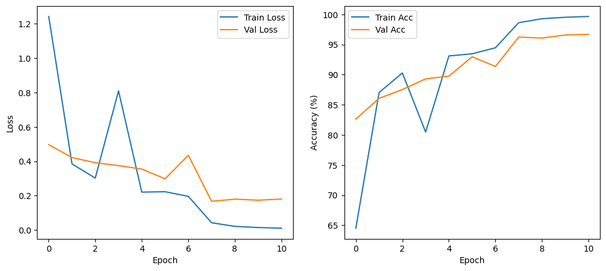

# American Sign Language (ASL) Alphabet Recognition

This project aims to create a deep learning model from scratch using PyTorch to be able to classify images of the American Sign Language (ASL) alphabet. The goal is for it to be able to accurately and quickly recognize the 26 letters of the ASL as well as the "space" and "nothing" signs from image data. This project was developed alongside my teammates as a final project for the Machine Learning (ML) course at our university.

## Dataset

The model was trained on the **ASL Alphabet** dataset from Kaggle. It contains a collection of images of alphabets from the American Sign Language, separated in 29 folders which represent the various classes.

To run this project, you must first download the dataset from the following link:
[Kaggle ASL Dataset](https://www.kaggle.com/datasets/grassknoted/asl-alphabet)

Once downloaded, unzip the ```archive.zip``` file and place the contents to the ```/data``` directory.

## Model

Our final model is a Convolutional Neural Network (CNN) trained for image classification. A pre-trained model of our final model (```best_asl_model.pth```) can be downloaded from the following link due to file size constraints:
[Download best_asl_model.pth](https://github.com/MechaOrange1/ASL-Alphabet-Recognition/releases/download/v1.0.0/best_asl_model.pth)

Once downloaded, place the ```.pth``` file in the ```/models``` directory.

## Model Performance

This model was trained for 25 epochs. The training accuracy and class-specific perfomance can be seen below:
| Training Accuracy/Loss Curve | Confusion Matrix Heatmap |
| :--------------------------: | :----------------------: |
|  |  |

## Live Demo
[Live Demo](https://huggingface.co/spaces/Mechabruh/ASL-Alphabet-Recognition)

## Setup & Installation

1. Clone this repository:
```bash
git clone https://github.com/MechaOrange1/ASL-Alphabet-Recognition.git
```

2. Navigate into the project repository:
```bash
cd ASL-Alphabet-Recognition
```

3. Install the required dependencies:
```bash
pip install -r requirements.txt
```

4. Download the dataset as instructed above.

## Usage

All the code for data preprocessing, model training and evaluation is in the Jupyter Notebook file at: ```notebooks/aol_torch.ipynb```.